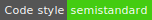

# peerhaven

peerhaven is going to be a place for you to save and share your bookmarks; we're not there, yet.

Our architecture is rather modular, with the different parts being separated across repositories:

- [**web**](https://github.com/peerhaven/web): Web app core

## Contributing

See our [guide for contributors](CONTRIBUTING.md).

## Colophon

See our [colophon](COLOPHON.md).

## License

peerhaven has [no license](https://choosealicense.com/no-permission/) so far which puts our work under exclusive copyright.
There is an [open issue](https://github.com/peerhaven/peerhaven/issues/1) for discussing this.
