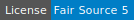

# Peerhaven

Peerhaven is going to be a place for notes, but we're not there, yet.

## Contents

- [Architecture](#architecture)
- [Documentation](#documentation)
- [License](#license)

## Architecture

Our architecture is rather modular, with the different parts being separated across repositories:

- [**web**](https://github.com/peerhaven/web): Web app

## Documentation

- [Setup instructions](SETUP.md)
- [Guide for contributors](CONTRIBUTING.md)
- [Security policy](SECURITY.md)
- [Colophon](COLOPHON.md)

## License

- Peerhaven (i.e. its software / source code) is licensed under [Fair Source 5 (v0.9)](https://fair.io/)
- Documentation and media are licensed under [Creative Commons Attribution 4.0 International](https://creativecommons.org/licenses/by/4.0/)
- For questions / discussion, refer to this issue:
  [#1 Pick a license](https://github.com/peerhaven/peerhaven/issues/1)
